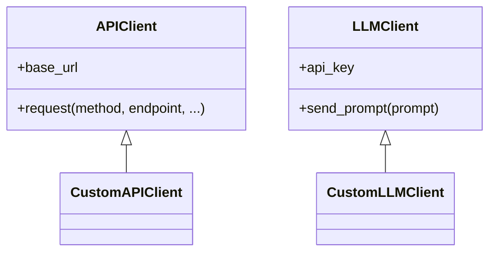

# Architecture: Communication Modules

## Design Rationale
- **LLMClient** and **APIClient** provide unified, extensible interfaces for external communication.
- Both are designed for easy subclassing and mocking, supporting modularity and testability.

## Class Structure

## Integration Points
- **APIClient**: Used by workflow components to fetch/send data to external APIs (e.g., sports data, notifications).
- **LLMClient**: Used in event processing for NLP tasks (e.g., summarization, classification).

## Extensibility
- Subclass to add new providers, endpoints, or authentication methods.
- Register new subclasses in the factory for dynamic selection.

## Testing
- Both modules are designed for dependency injection and mocking in tests.
- See ONBOARDING.md for test instructions.
